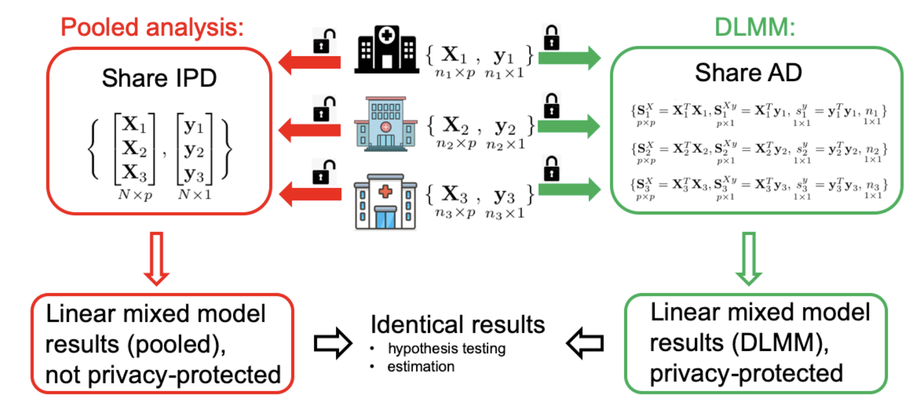

DLMM: Lossless One-shot Distributed Linear Mixed Model for a Multisite International Study of COVID-19 Hospitalization Length of Stay
==============================================


## Outline
1. Description
2. DLMM workflow
3. Package requirements
4. Install package
5. Run DLMM
6. Results and running time
7. How to run DLMM on your data?

## Description
DLMM is a distributed algorithm under [PDA](https://github.com/Penncil/pda) (Privacy-preserving Distributed Algorithms) framework. The package in this repo is for the whole PDA framework, including other distributed algorithms. This README will focus on the implementation of DLMM only.

## DLMM workflow


## Package Requirements
- A database with clear and consistent variable names
- R version: R (>= 3.5.0)
- On Windows: download and install [RTools](http://cran.r-project.org/bin/windows/Rtools/) 
- For ODAC (One-shot distributed algorithm for Cox regression) in the pda package, make sure you have cpp compiler as ODAC requires [Rcpp](https://cran.r-project.org/web/packages/Rcpp/vignettes/Rcpp-FAQ.pdf).


## Install package

To implement DLMM algorithms, we need to install the `pda` package. There are several ways in which one could install the `pda` package. 

1. In RStudio, create a new project: File -> New Project... -> New Directory -> New Project. 

2. Execute the following R code: 

```r
# Install the latest version of PDA in R:
install.packages("pda")
library(pda)

# Or you can install via github:
install.packages("devtools")
library(devtools)
devtools::install_github("penncil/pda")
library(pda)
```

The installation time is about 5 secs via CRAN and 20 secs via github. 

In the toy example below we aim to analyze the association of hospitalization length of stay (LOS) with age, sex and lab test using linear model, data(LOS) is simulated and assumed to come from 3 sites: 'site1', 'site2', 'site3'. 

We demonstrate using PDA DLMM can obtain identical estimation as the pooled analysis. 

We run the example in local directory. In actual collaboration, account/password for pda server will be assigned to the sites at the server https://pda.one. Each site can access via web browser to check the communication of the summary stats.

### *Run DLMM example with demo()*

```r
demo(DLM)
``` 

### *Run DLMM example with code*

Step 0: load related R packages and prepare sample data

```r
## load packages
require(lme4)
require(minqa)
require(data.table)
require(pda) 

## sample data
data(LOS)  

## create 3 sites, split the data
sites = c('site1', 'site2', 'site3')
LOS_split <- split(LOS, LOS$site)

## fit LM using pooled data, assuming fixed site effect
fit.pool <- lme4::lmer(los~age+sex+lab+(1|site), REML = F, data=LOS)
``` 

Step 1: Initialization

```r
# ############################  STEP 1: initialize  ###############################
control <- list(project_name = 'Length of stay study',
                step = 'estimate',
                sites = sites,
                heterogeneity = TRUE,
                heterogeneity_effect = 'random',
                model = 'DLM',
                family = 'gaussian',
                outcome = "los",
                variables = c('age', 'sex', 'lab'),
                # variables_heterogeneity = c('Intercept'),
                optim_maxit = 100,
                lead_site = 'site1',
                upload_date = as.character(Sys.time()) )

## run the example in local directory:
## specify your working directory, default is the tempdir
mydir <- getwd()  # tempdir()
pda(site_id = 'site1', control = control, dir = mydir)


## in actual collaboration, account/password for pda server will be assigned, thus:
# pda(site_id = 'site1', control = control, uri = 'https://pda.one', secret='abc123')
## you can also set your environment variables, and no need to specify them in pda:
# Sys.setenv(PDA_USER = 'site1', PDA_SECRET = 'abc123', PDA_URI = 'https://pda.one')
# pda(site_id = 'site1', control = control)


## assume remote site3: enter "1" to allow tranferring your local estimate 
pda(site_id = 'site3', ipdata = LOS_split[[3]], dir=mydir)


## assume remote site2: enter "1" to allow tranferring your local estimate  
pda(site_id = 'site2', ipdata = LOS_split[[2]], dir=mydir)


## assume lead site1: enter "1" to allow tranferring your local estimate  
## control.json is also automatically updated
pda(site_id = 'site1', ipdata = LOS_split[[1]], dir=mydir)
 
``` 

Step 2: Final results
```r 
# ############################  STEP 2: final results  ###############################

config <- getCloudConfig(site_id = 'site1', dir=mydir)
fit.dlm <- pdaGet(name = 'site1_estimate', config = config)

## Compare with pooled analysis
# fixed effects
cbind(b.pool = summary(fit.pool)$coef[,1],
      b.dlm = c(fit.dlm$bhat),      
      sd.pool = summary(fit.pool)$coef[,2],  
      sd.dlm = fit.dlm$sebhat)  

# var component
cbind(data.frame(summary(fit.pool)$varcor)$vcov, 
      c(fit.dlm$Vhat, fit.dlm$sigmahat^2) )

# random effects (BLUP)
cbind(u.pool = ranef(fit.pool)$site,
      u.dlm = c(fit.dlm$uhat))
```


## Results and Running time

Fixed effect:

|             | b.pool     | b.dlm   | sd.pool     | sd.dlm |
|-------------|------------|---------|-------------|--------|
| (Intercept) | 8.1427882  | 8.1431  | 0.492562341 | 0.4928 |
| ageold      | 0.9216823  | 0.9217  | 0.284036488 | 0.2848 |
| ageyoung    | -0.9825288 | -0.9825 | 0.347824193 | 0.3487 |
| sexM        | 0.4532778  | 0.4532  | 0.254514252 | 0.2552 |
| lab         | 0.1019632  | 0.1020  | 0.004262868 | 0.0043 |

Random effect (BLUP):

|        | (Intercept) | u.dlm   |
|--------|-------------|---------|
| site1  | -0.03998285 | -0.0403 |
| site2  | 0.80703882  | 0.8063  |
| site3  | -0.76705598 | -0.7661 |


The running time in each site in this demo is about 4-5 secs. 


## How to run DLMM on your data?

* Get the data ready, which requires no missing values and clear variable names.
* Define the `control` by specifying the model, data, outcome, variables, site names, and local site.
* Directly run `pda` function.
